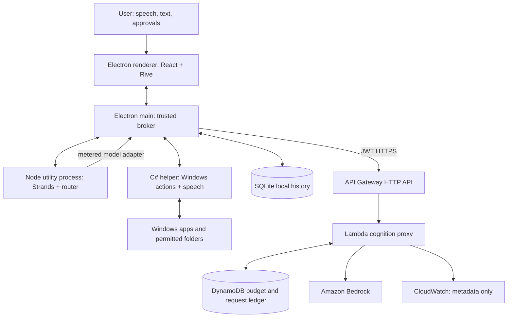
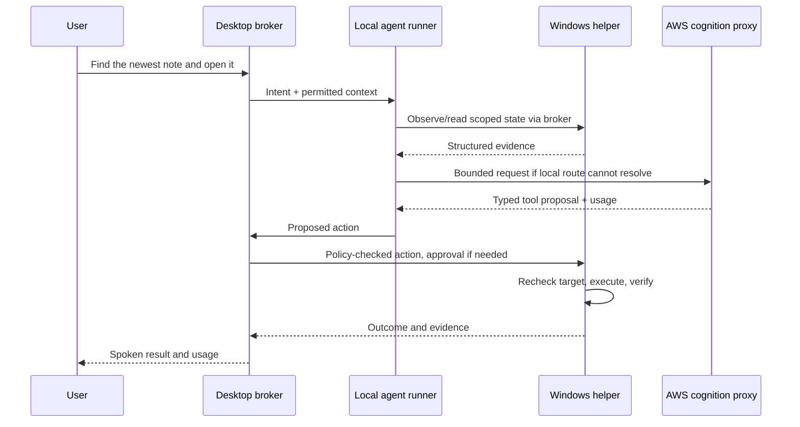

# KLIP — System Architecture

**Version:** 2.0.0 · **Date:** 2026-09-19 · **Scope:** Windows-first standalone implementation

## 1. Governing decisions

- The desktop SDK owns computer use; the companion owns presentation.
- Routine intent resolution and all OS actions happen locally.
- AWS provides bounded model inference through a metered backend, not direct remote desktop access.
- Perception escalates only when the required target or fact is unresolved.
- Policies and result verification execute outside the language model.

## 2. System context



## 3. Deployment boundary

| Device | AWS H24 | Deferred |
|---|---|---|
| Electron/React/Rive, SDK, local Strands runner | Cognito public OAuth client | AgentCore-hosted cloud workflows |
| C# helper, UIA3/Win32, sherpa-onnx | HTTP API and cognition Lambda | Cross-device memory sync |
| SQLite, DPAPI-protected content | Bedrock calls and DynamoDB ledger | Third-party agent federation |

AWS does not invoke an inbound endpoint on the laptop. Every cloud request is initiated by the desktop. The helper runs in the interactive logged-in user's session, not as a privileged Windows service.

## 4. Process responsibilities

| Process | Responsibility | Failure behavior |
|---|---|---|
| Sandboxed renderer | Render, text input, explicit approval UI | Restart presentation; pending execution stays paused |
| Electron main | IPC validation, approvals, auth, SQLite writer, helper lifecycle | Helper detects parent-channel closure and stops accepting work |
| Node utility process | Local routing, Strands agents, bounded plan state | Main cancels pending dispatch; committed actions remain logged |
| C# helper | UIA observation, execution, local speech and policy recheck | No automatic replay of unacknowledged mutations |

CPU-heavy/native work stays off the renderer and main event loops. Async tasks are not assumed to isolate unsafe native calls; a blocked helper is terminated and restarted only after outstanding actions are marked unknown.

## 5. Voice path

```text
microphone → local keyword spotter → activation cue → local VAD/STT
           → transcript → local router / agent
           → response text → local TTS → speaker
```

At idle only the keyword detector and necessary audio buffers run. Raw audio is transient and not uploaded in H24. Wake activation has a configurable follow-up window and explicit visual indication. TTS playback suppresses wake detection in H24; the stop-speaking control remains available. Full echo-aware barge-in is stretch.

## 6. Routing

| Route | Trigger | Paid model use |
|---|---|---|
| `local-command` | Supported command with unambiguous parameters | None |
| `local-model` | Optional model installed and request within its capabilities | None; local inference tokens tracked separately |
| `cloud-text` | Novel conversation, planning, or semantic ambiguity | Bedrock text call |
| `cloud-vision` | Explicit image question or unresolved visual target | Bedrock image call |

Saved preferences aid routing but never grant privileges. A local command may require clarification rather than a cloud call. Budget exhaustion preserves local operations. It never silently changes cloud mode or routes to an unapproved provider.

## 7. Perception and target resolution

Use **P0 events**, **P1 accessibility**, **P2 local OCR**, **P3 cloud vision**. These names differ deliberately from risk tiers R1–R4.

1. On invocation or relevant UI event, inspect the target process/window. H24 does not observe the entire day by default.
2. Retrieve a bounded UIA subtree. Use stable AutomationId and scoped role/name when available.
3. Check task-specific sufficiency: requested control/fact exists, is unique, is in the correct window, and has suitable state. Pixel-area coverage is not used.
4. If needed, OCR a relevant crop; if still unresolved, ask for consent to share a bounded image region and escalate to P3.
5. Bind the resolved target to snapshot revision, process identity, window, bounds, and expected role. Revalidate before execution.

A visual hash is an optimization hint only. Semantic events, changed values, focus changes, and verification reads bypass hash reuse. Cached coordinates are never authoritative.

## 8. Execution order

| Priority | Adapter | Example |
|---|---|---|
| 1 | Typed native operation | Open allowed app; inspect directory; Office COM stretch |
| 2 | UIA action | Invoke a named button, select menu, set editable text |
| 3 | Controlled browser adapter, when installed | Read DOM or navigate prepared browser session |
| 4 | Win32 input | Physical click/key into a freshly validated target |

Every adapter returns evidence, not a human-style success sentence. A single mutation queue serializes desktop actions across all agents. Reads that depend on focus also acquire that queue; independent file reads or reasoning may run concurrently.

## 9. Action lifecycle

```text
proposed → validated → awaiting-approval (when required) → dispatched
         → verified | failed | unknown | cancelled | refused
```

Before dispatch, persist the action ID and check target freshness and policy. After dispatch, use fresh native evidence against typed assertions. A timeout after a possibly successful effect yields `unknown`, not `failed`. Only operations with declared retry semantics can be retried. Cancellation prevents further dispatch; it does not undo an already submitted action.

## 10. Novel-task data flow



## 11. Persistence and concurrency

SQLite stores tasks, snapshots, action events, preferences, bounded conversation history, and usage. Sensitive text fields are encrypted before persistence with a user-scoped DPAPI key envelope. Structural metadata remains in a user-private directory. No SQLite encryption property is implied by the storage engine itself.

Acknowledged request/response channels carry actions and approvals. Lossy/coalesced UI updates may carry current status, but a UI can always resynchronize from durable state. Defaults and limits are defined once in [10](10-API-CONTRACTS.md).

## 12. Degradation

| Event | Result |
|---|---|
| Internet lost / daily budget exhausted | Local commands and voice remain; cloud tasks pause visibly |
| Microphone disabled | Text and push-to-talk availability shown accurately |
| Target elevated/locked/unavailable | Refuse or request user intervention; no elevation bypass |
| UI changes between plan and action | Discard binding and re-observe |
| User changes focus/input during mutation | Pause subsequent work and revalidate |
| Cloud call times out | Preserve reservation and reconcile request ID; do not issue duplicate inference blindly |

## 13. Cross-platform evolution

The public SDK uses platform-neutral identifiers and capabilities. Windows-specific HWND, COM objects, and handles stay inside the helper. Future macOS/Linux helpers must satisfy the same contract and return `UNSUPPORTED_CAPABILITY` where appropriate. This boundary enables portability; it does not establish present support.

