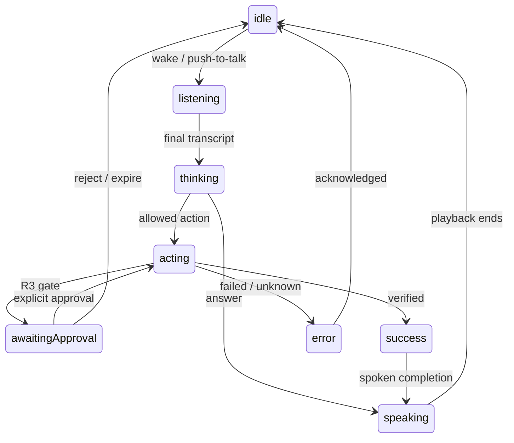

# KLIP — Design Guidebook

**Version:** 2.0.0 · **Date:** 2026-09-19 · **Surface:** Electron/React with Rive animation

## 1. Experience direction

KLIP is a friendly companion that can also operate the computer. The user should be able to greet it, ask a question, request an action, and understand its response without navigating an agent dashboard. Detailed execution and spending remain available in the expanded panel.

Personality comes from timing, eye expression, voice and responsive movement. It must not imply that KLIP is listening when muted, acting when idle, or successful when verification failed.

## 2. Windows placement

| Property | Initial design value |
|---|---|
| Collapsed pill | 160 × 56 device-independent pixels |
| Expanded panel | 380 × 480 DIP; clamp to available work area |
| Edge gap | 16 DIP from right and bottom of monitor work area |
| Character area | 44 × 44 DIP, flexible silhouette |
| Minimum control target | 44 × 44 DIP |

Position relative to Electron `screen` work area, not a hardcoded taskbar height. Anchor the bottom-right corner while expanding upward/leftward. Persist the chosen display and clamped position; recover onto an available monitor after unplugging one. Test 100%, 125%, 150% and 200% scaling and negative-coordinate displays.

Use a frameless, transparent, always-on-top window with a tray entry. Do not steal focus on every state update. Only input invocation or explicit approval presentation should request keyboard focus. Transparent areas must not block unrelated desktop interaction; verify hit behavior on the packaged Windows build.

## 3. Main surfaces

| Surface | Content |
|---|---|
| Collapsed companion | Character, listening/mute indicator, one short status |
| Conversation panel | Transcript, concise replies, text input, microphone controls |
| Task detail | Current operation, verified steps, stop control, evidence summary |
| Approval panel | Exact resource/content, approve/reject, expiry and reason |
| History/usage | Prior tasks, explicit preferences, token/cost ledger, forget controls |

The default panel opens conversation, not a workforce list. Agent names appear as secondary detail only when useful.

## 4. State machine

These names match [10](10-API-CONTRACTS.md).

| State | Face/motion | User meaning |
|---|---|---|
| `idle` | Relaxed eyes, occasional blink, restrained breathing | Available |
| `listening` | Attentive eyes, input-level indicator | Microphone capturing an active request |
| `thinking` | Focused gaze, slow purposeful motion | Resolving the request |
| `speaking` | Playback-driven mouth/shape motion | Audio response playing |
| `acting` | Directed gaze, small controlled movement | Desktop operation in progress |
| `awaiting-approval` | Steady attentive pose, clear action card | Waiting for explicit decision |
| `success` | Brief smile or nod, then idle | Required result verified |
| `error` | Concerned expression, readable explanation | Failure or unresolved outcome |

Connectivity, microphone mute and cloud-budget status are orthogonal badges, not extra numeric character states. Unknown outcomes use error presentation with “I couldn't confirm whether that completed”; cancellation returns to idle after showing a short status.

Diagram label `awaitingApproval` maps to wire state `awaiting-approval`; the wire name is authoritative.

## 5. Rive asset contract

**Asset:** `assets/rive/klip.riv` · **Artboard:** `KlipCompanion` · **State machine:** `KlipState`

| Input | Type | Values |
|---|---|---|
| `state` | Number | 0 idle, 1 listening, 2 thinking, 3 speaking, 4 acting, 5 awaiting-approval, 6 success, 7 error |
| `speechLevel` | Number | 0–1 local TTS amplitude envelope |
| `inputLevel` | Number | 0–1 local microphone level during active listening |
| `gazeX`, `gazeY` | Number | -1 to 1, clamped pointer-relative position |
| `reducedMotion` | Boolean | Disable continuous/sweeping motion |
| `blink` | Trigger | Idle micro-expression, suppressed when inappropriate |

React renders all functional controls. Rive renders the character, not the approval text or executable buttons. Pin input names and mapping in a manifest so mismatches fail visibly at development time. A missing Rive asset falls back to readable static state; do not show a frozen “working” character indefinitely.

## 6. Motion and resource budget

Use springs for expansion and short state changes; aim for 180–280ms transitions. Speech amplitude drives a simple opening/shape response, not claimed phoneme alignment. Render active animation at 30fps initially; reduce idle work and stop rendering when hidden. Pause gaze tracking outside relevant pointer proximity.

Honor reduced-motion settings: remove breathing, oscillation, large travel and repeated glow pulses; keep state readable through shape/text. No animation performance or CPU figure is assumed from selecting Rive. Measure the packaged app with local voice armed.

## 7. Visual tokens

| Token | Initial value | Use |
|---|---|---|
| Background | `#101216` | Main panel |
| Raised | `#1B1F26` | Cards |
| Primary text | `#F5F7FA` | Labels and content |
| Secondary text | `#B6BDC8` | Supporting text |
| Accent | `#8ED8C5` | Active/available |
| Attention | `#FFD089` | Approval |
| Error | `#FF9C9C` | Failure/unknown |

Use Segoe UI/system sans for native familiarity; tabular numerals for spending. Body text 14–16px; avoid 11px critical content. Validate actual contrast and keyboard focus indicators. Rounded panel corners may be 20px; the character shape is original KLIP artwork, not copied HeyClicky assets.

## 8. Approval and cloud sharing

Approval shows the exact action, destination and changed content. Show create versus overwrite explicitly. Reject and approve have comparable prominence; neither Enter nor voice auto-approves. Edits create a new preview and invalidate the previous approval. A long payload scrolls and remains fully inspectable.

Image sharing has its own preview: selected window/crop, what will be sent, and a task-scoped permission. “Local only” has a persistent indicator. If switching to cloud, explain why in one sentence and show the mode/consent outcome. Screen-sharing consent never authorizes desktop mutations.

## 9. Cost and history panels

Per request, show local/cloud route, model input/output tokens where known, estimated inference cost and pending reservation if unresolved. Daily totals distinguish confirmed estimate from pending exposure. Other AWS costs are shown separately or explicitly unavailable; do not label inference totals “entire AWS bill.”

History lists the user's request, outcome, applications involved, time and cost. Screenshots are not retained by default. Preferences can be inspected/deleted without reading a long log. H24 requires these basic controls even if the full settings design is deferred.

## 10. Accessibility and checks

- Full keyboard access with visible focus; approval modal focus trap and a clear escape-to-reject path.
- Screen-reader labels and polite live updates; speech responses do not replace text equivalents.
- No color-only status; mute and offline remain readable without animation.
- Native taskbar/notification overlap, multi-monitor placement and pointer interception tested on Windows.
- Original `.riv` plus static fallback, state manifest, UI tokens, approval panel and usage panel delivered before recording.

Reference: [Electron screen API](https://www.electronjs.org/docs/latest/api/screen). Geometry and animation values above are KLIP design choices, not Electron guarantees.

