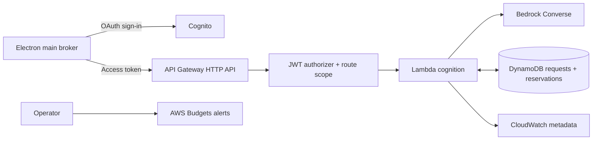

# KLIP — AWS Infrastructure and Cost Model

**Version:** 2.0.0 · **Date:** 2026-09-19 · **Credit assumption:** user-reported $100; verify eligibility and balance in the account

## 1. AWS's role

AWS supplies authenticated, metered intelligence for a locally running companion. The H24 implementation uses Cognito, API Gateway HTTP API, Lambda, Bedrock and a DynamoDB request/budget ledger. It does not require EC2, a NAT gateway, an always-running container, AgentCore, or a cloud speech stream.

Strands orchestration remains on the desktop and calls the proxy through a custom model adapter. A Lambda invocation performs one bounded model request; it does not wait for the user to approve desktop operations. A task may involve several separate requests, governed by one budget and call limit.

## 2. Service topology

S3/CloudFront may host release artifacts and a small submission page. Their costs and permissions are separate from inference. No screen archive or cloud memory sync is needed for H24.

## 3. Configuration

| Resource | Proposed setting | Reason |
|---|---|---|
| Region | `us-east-1` candidate; verify exact model availability/latency | Do not assume all models available in all accounts |
| Cognito | User pool, public app client, authorization code + PKCE | Desktop app cannot keep a client secret |
| API | HTTP API, JWT issuer/audience and required access-token scope | Authenticated metered proxy |
| Cognition Lambda | Supported Node.js 22/24 runtime, ARM64, 512MB initial memory, 25s timeout | Small inference proxy; benchmark sizing |
| Lambda concurrency | 2 reserved if account quota permits | Limits concurrent work; not a spend cap |
| API throttling | Initial stage 2 requests/s, burst 4; add per-user admission limits | Reduce accidental loops |
| DynamoDB | On-demand table, point reads/conditional transactions | Low-volume admission ledger |
| CloudWatch | Metadata-only logs, 7-day retention | Diagnose without retaining user screen content |
| Infrastructure | CDK TypeScript, Bun-managed dependencies | Reproducible isolated deployment |

API Gateway HTTP API integration timeout is bounded; KLIP uses a 20s model deadline inside a 25s Lambda and a 28s client timeout. The 30s HTTP API maximum is not a guarantee of model completion. Longer inference requires an explicit async design or later AgentCore path, not merely raising Lambda timeout. [HTTP API quotas](https://docs.aws.amazon.com/apigateway/latest/developerguide/http-api-quotas.html)

## 4. Authentication and tenant boundaries

Use system-browser sign-in and a registered callback appropriate to the desktop OAuth implementation. Validate state and PKCE; store refresh material using DPAPI-protected storage. Bearer tokens remain in the broker, not the renderer or agent context.

API authorizer validates issuer, audience, expiry and required scope. Lambda derives the user identifier from trusted JWT claims, never a caller-supplied user ID. All requests, responses and usage reads are keyed to that owner. A session/task/device ID is an application identifier, not proof of identity or hardware binding.

The execution IAM role permits only the configured Bedrock model/inference-profile resources and exact DynamoDB/log resources. If cross-region inference is selected, explicitly enumerate and explain destination-region permissions and residency. No long-lived AWS access key is embedded in the desktop installer.

## 5. Model request handling

1. Validate schema version, ownership, tool manifest, context/image sizes, purpose, rate limits and project kill switch.
2. Resolve the allowlisted model for the purpose; count input or calculate a conservative documented upper bound, including image metering.
3. Atomically reserve the upper-bound inference amount and request slot before invoking Bedrock.
4. Call Converse with explicit output cap and deadline; validate the returned tool calls against shipped tool schemas.
5. Persist usage/result and settle reservation atomically; return the response. On uncertain failure keep a pending reservation and an inspectable request ID.

Only server-selected model IDs are allowed. No placeholder model ID is presented as deployable configuration. Set `BEDROCK_TEXT_MODEL_ID`, `BEDROCK_VISION_MODEL_ID`, region and the price table after successful account-specific test calls. A single compatible model may serve both purposes. If using a token-count API, verify support for that exact model and grant its required IAM action; otherwise use a proven conservative bound or reject the request. Unknown pricing fails closed rather than producing a zero estimate.

## 6. DynamoDB ledger

Use a single table with `PK` and `SK`. This is a different dataset from local conversation history.

| PK | SK | Core fields |
|---|---|---|
| `PROJECT#klip-event` | `BUDGET` | settled, reserved, inference limit, enabled |
| `USER#` | `DAY#<UTC-date>` | settled, reserved, daily limit |
| `USER#` | `TASK#<id>` | settled, reserved, admittedCalls, task limit |
| `USER#` | `REQUEST#<id>` | payload hash, reserve amount, model, state, result, usage, expiry |

Amounts use integer microdollars. Input values are bounded to prevent precision/overflow problems in JavaScript and database serialization. Task IDs cannot override the daily/project caps.

### Atomic admission

Maintain `remaining` counters initialized from server policy. A DynamoDB transaction conditionally subtracts the reservation from remaining and adds it to reserved for project/day/task, increments admitted calls within its cap, and conditionally creates the request record. All conditions succeed together or nothing is admitted. Precreate counters with conditional initialization to handle concurrent first requests.

An identical request ID/hash returns its existing result or pending state. A mismatched hash returns 409. The date bucket is frozen at reservation time; midnight does not move a pending request or make a retry free.

### Settlement and unknown requests

On confirmed usage, transactionally move reserve to settled actual cost and return unused allowance, conditioned on the request still being reserved. Double settlement is rejected. If actual cost unexpectedly exceeds the bound, record the overage, disable admission and investigate; no accounting system can retroactively prevent an already incurred charge.

Timeout, disconnect or client cancellation does not prove the provider did no work. Keep the reservation unless confirmed usage or a definite pre-invocation failure permits settlement/release. Reconcile operator-visible unknown requests; TTL must never silently free an uncertain reservation. This conservative behavior may temporarily reduce available budget.

## 7. Budget plan

| Category | Allocation / limit | Interpretation |
|---|---|---|
| Bedrock admission | $30 total event ceiling | Enforced against conservative reservation bounds |
| Backend/artifacts/logging | $10 planning allowance | Actual billing may lag; monitor separately |
| Total event target | $40 | Operational target, not an absolute AWS billing cap |
| Remaining stated credit | $60 contingency | Credit applicability must be verified |
| User/day, task, call | $2 / $0.20 / $0.05 | Server defaults from [10](10-API-CONTRACTS.md) |

This is a budget allocation, not a predicted $40 invoice. AWS credit coverage, free tier, model access and regional pricing depend on the account. Do not describe Lambda, Cognito, DynamoDB, storage or KMS as universally free. There is no customer-managed KMS key requirement in H24; default managed service encryption is acceptable for this limited metadata ledger. V1 may add CMKs with their own costs.

Record input/output/cache usage from Bedrock and multiply by the dated model price table. The UI shows an inference estimate, not the AWS bill. Search and cloud audio would add separate charges if introduced later. [Bedrock Converse](https://docs.aws.amazon.com/bedrock/latest/APIReference/API_runtime_Converse.html) · [Pricing](https://aws.amazon.com/bedrock/pricing/)

## 8. Alerts and kill switch

Set billing alerts at $10, $25 and $40 as advisory thresholds. AWS Budgets uses delayed billing data, so alerts cannot enforce a per-request limit. [AWS Budgets guidance](https://docs.aws.amazon.com/cost-management/latest/userguide/budgets-best-practices.html)

The immediate inference kill switch is the DynamoDB project `enabled=false` condition checked in every admission transaction. Emergency operator shutdown also sets cognition Lambda reserved concurrency to zero where supported. Both text and vision share that function/guard. Already admitted/in-flight calls can still finish and incur cost.

Rate limits, Lambda concurrency and max tokens supplement budget reservations; none replaces them. A malicious authorized caller can still consume request infrastructure costs, so also limit request size, authentication attempts and per-user throughput.

## 9. Deployment procedure

| Stage | Completion evidence |
|---|---|
| Account preparation | Credit balance/terms checked; eligible models respond in selected region |
| Isolated stack | Cognito, API, Lambda, ledger and logs deployed with project tags |
| Auth integration | Desktop PKCE flow works; expired/wrong-user requests fail |
| Accounting test | Concurrent near-limit calls cannot exceed reserved allowance |
| Model adapter | Strands tool calls round-trip through proxy and local SDK |

Use a dedicated stack/environment and synthetic data. The source documentation provides the intended stack, not a command to deploy the user's existing MeetStream environment. Do not copy that infrastructure or credentials.

The health endpoint proves availability only; submission should include an actual authenticated capability demo. Provide a hosted project page with video, architecture, downloadable client and setup guidance when pursuing Ship It. Judge access to any protected demo is deliberate and scoped.

## 10. Post-hackathon hosting

AgentCore is an optional V1 host for long-running cloud-only specialists. Moving orchestration there requires checkpoint/resume and a secure desktop tool-return channel; it does not enable inbound unrestricted control of laptops. Cloud work waits when the local helper is offline. Local conversation/history stays independent of cloud availability.

Cross-device preferences, S3 artifacts and scheduled jobs need separate consent, retention, authorization and budget design. Add these only after evidence shows that the local-first workflow needs them.
